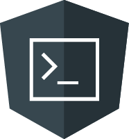
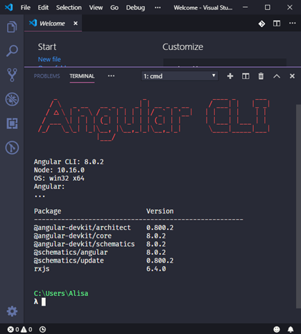
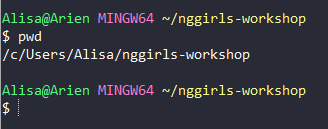
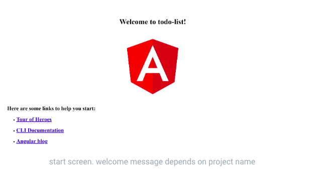

# Angular CLI



An advantage of Angular is its powerful **C**ommand **L**ine **I**nterface \(**CLI**\). This is a special tool we can use to quickly create an Angular application. The Angular CLI will scaffold the framework for a web application so we can be up and running in no time!

## Install Angular CLI

In the terminal, run the following command:



```bash
npm install --global @angular/cli
```



To verify your installation, check the Angular CLI version by typing:



```bash
ng version
```



If you see output with a version number, your Angular CLI installation is successful.




## Create the application project

Next we'll create a new Angular project, called `todo-list` using the Angular CLI. This is the web application we'll work on during the workshop.

Make sure your terminal is still inside the `nggirls-workshop` folder. 


Your terminal displays your current path above or as part of the command prompt. You can also run the `pwd` command to see your working directory. If you see `nggirls-workshop` in your path, you're good to go!





Then run the following command to create the Angular project:



```bash
ng new todo-list
```




Angular CLI will ask a couple of questions to help create a new application. Answer the questions as shown below: 

1. Would you like to add Angular routing? (y/N): N 
2. Which stylesheet format would you like to use? (Use arrow keys): CSS (Press `Enter` to select CSS)

This can take a while, since many packages are being downloaded from the web and installed.

Now change your working directory to the new folder that Angular CLI created for this project by running:



```bash
cd todo-list
```




## Open the project in Visual Studio Code

We want to open the project in your IDE. We can use the toolbar inside VS Code or the command line.

Open VS Code in this folder using the command line by running:



```bash
code .
```




You can also open the project folder using the toolbar by selecting **File**  **Open Folder...** and navigating to the `~/nggirls-workshop/todo-list` folder.

Close your terminal window.

## Serve the application

We'll now switch over to using the integrated terminal in Visual Studio Code.


For the workshop you will use the terminal in VS Code. Having your IDE and terminals together in one application will make it easier to follow the tutorial without having to juggle between so many different application windows.


In VS Code, open a terminal window by selecting **Terminal**  **New Terminal**.


Visual Studio Code should automatically open the terminal to your project location (`~/nggirls-workshop/todo-list`). If it doesn't, navigate there by running the command `cd ~/nggirls-workshop/todo-list`.



In the terminal inside VS Code, run the following command to serve your application. This process continues in a "stuck" state until you tell it to stop.



```bash
ng serve -o
```



The flag `-o` is a short for `--open`, which will open your default browser to where the application is running: `localhost:4200​`. 


If the application doesn't open in Google Chrome, copy the URL of the application, open a new Chrome tab, and paste in the application URL. You will have to repeat this at the workshop when starting up your project.


You should see a page like this:



Yay! You know have a running Angular application! As long as you're working on the application you should keep the terminal where you run it open. Any change you make in the project code will be reflected immediately in the web browser.

You can open another terminal to perform tasks in parallel.
To stop the app from running and exit "stuck" state, press `CTRL` + `c` in the terminal.


## **Congratulations!**

You've reach the end of the installation worksheet. You have installed all of the tools you will need to build your first Angular application!

Give yourself a pat on the back! We look forward to seeing you back here tomorrow to continue working on your to-do list app.


