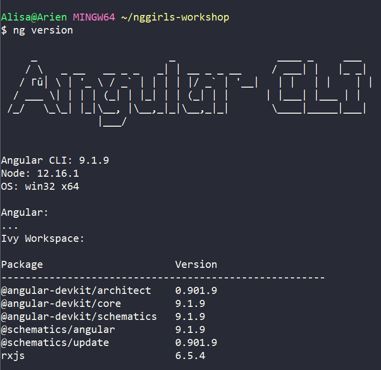

# Angular CLI


An advantage of Angular is its powerful **C**ommand **L**ine **I**nterface \(**CLI**\). This is a special tool we can use to quickly create an Angular application. The Angular CLI will scaffold the framework for a web application so we can be up and running in no time!

Open terminal for Macs and Linux or GitBash for Windows and install Angular CLI by typing the following command and press `Enter`. You will always press `Enter` after each command typed in the terminal unless otherwise instructed.

```bash
npm install --global @angular/cli
```


To verify your installation, check the Angular CLI version by typing

```bash
ng version
```

If you see output with a version number, your Angular CLI installation is successful.



