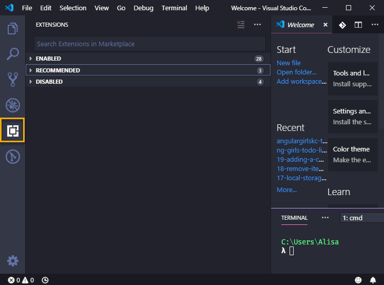

# Required Extensions

We will install the following required extensions:

* [Angular Essentials](https://marketplace.visualstudio.com/items?itemName=johnpapa.angular-essentials)- Adds Angular language support, code completion \(which helps fill in the blank as you type code\), and linting \(notifications in code to help catch errors\) 
* [Bracket Pair Colorizer](https://marketplace.visualstudio.com/items?itemName=CoenraadS.bracket-pair-colorizer)- Changes colors of opening and closing pairs of brackets to make it easier to identify nested JavaScript code
* [Guides](https://marketplace.visualstudio.com/items?itemName=spywhere.guides)- Adds indention guide lines making it easier for you to match tags in HTML and nested JavaScript code

To start installing extensions, select the **Extensions** icon on the left toolbar.

Type the name of the extension in the input, in this case, type "Angular Essentials". Find the "Angular Essentials" by John Papa and press the **Install** button to install the extension.

Repeat to install the other required extensions.

Visual Studio Code may prompt you to restart the application after installing an extension. Make sure you restart Visual Studio Code after installing all the required extensions if you didn't restart for each extension.

Close Visual Studio Code if you're not configuring optional settings.

