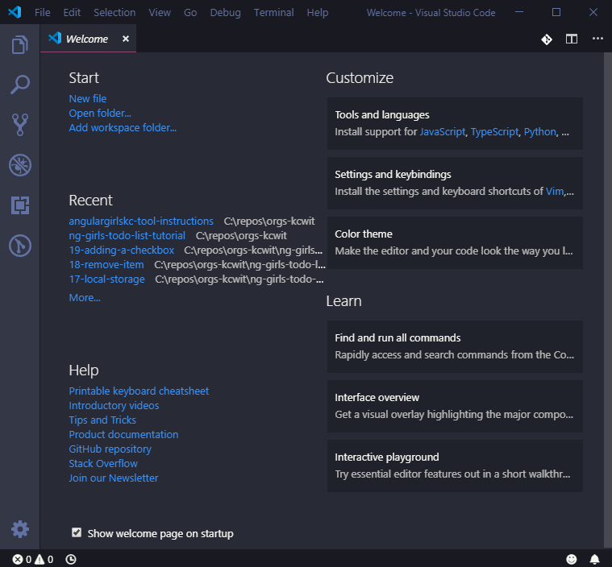

# Install Visual Studio Code

Download [Visual Studio Code](https://code.visualstudio.com/) by clicking the green **Download for &lt;Windows OR Mac OR Linux&gt;** button. This will download the **Stable Build** for your operating system.

When download is complete, run the installer. Use default selection for all settings when asked. Visual Studio Code will automatically launch when the installation is complete.

You will see a welcome screen that looks something like this.

## Open Integrated Terminal

Visual Studio Code has a built in terminal. This makes it easy for us to use the command line while also writing code without having to switch between applications!

To open your terminal, select **Terminal**  **New Terminal**. The terminal view opens along the bottom of your application. You can also open multiple terminals. 

We will use multiple terminal tabs tomorrow during the workshop.

### Configure Terminal Settings (Windows Only)

We will use Git Bash as our terminal for the workshop. This allows us to provide instructions that apply to all the different **OS** \(**O**perating **S**ystem\) attendees use. 

In the terminal pane, press the down arrow in the terminal shell dropdown and select **Select Default Shell**. 

You can now select you preferred terminal shell. Select **Git Bash**. 

Press the **+** button next to the terminal shell dropdown to open a new terminal using Git Bash.
JAD TODO- Try this on the Surface to make sure this step is necessary.