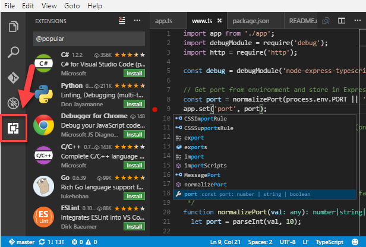
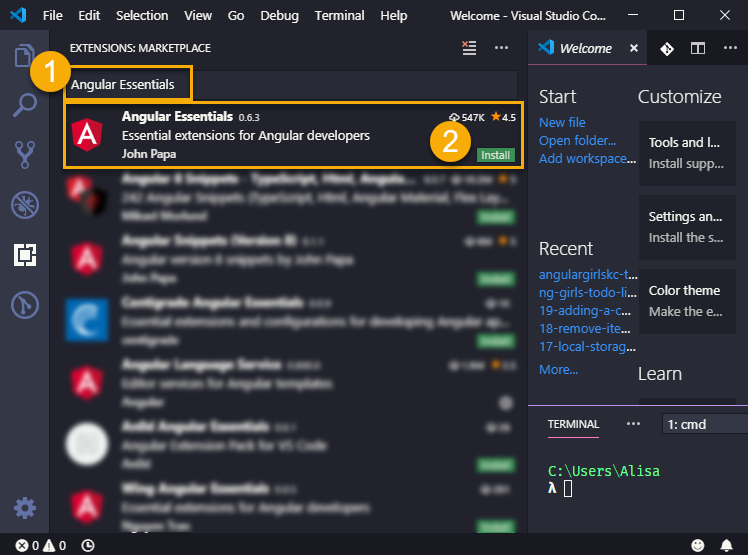

# Microsoft Visual Studio Code

Visual Studio Code is the **I**ntegrated **D**evelopment **E**nvironment \(**IDE**\) we use. It's software that helps you write the code. **IDE**s can do a lot of amazing things, such as:

* highlight the code so it's easier to identify expressions
* suggest completions to what you type
* help you navigate easily through the files in your project
* and a lot more...

After downloading we will configure it with extra tools called _extensions_ that will make your coding life easier.

## Install Visual Studio Code

Download [Visual Studio Code](https://code.visualstudio.com/) \(you'll often hear it referred as VS Code\) by clicking the green **Download for &lt;Windows OR Mac OR Linux&gt;** button. This will download the **Stable Build** for your operating system.

When download is complete, run the installer. Use default selection for all settings if asked.

## Configure Terminal Settings

**ALISA TO ADD MORE DETAILS HERE**

&lt;Goal here is to set VSCode to use Git Bash as the default terminal&gt;

## Install Required Extensions

We will install "Angular Essentials" extension by John Papa. When the installation is complete, open VS Code and select the **Extensions** icon on the left toolbar.

Type "Angular Essentials" in the input. Press the **Install** button to install the extension.

## Optional- Install Themes

The "Angular Essentials" extension includes a theme called "Winter is coming". You can choose a new theme by navigating to **File** -&gt; **Preferences** -&gt; **Color Theme** and select the theme you like out of the list.

If you want to try a different color theme, you can type in the theme you want in the **Extensions** search and click **Install**. 

Some popular themes include: 

* Night Owl
* Dracula
* Winter is Coming
* Summer Time
* Shades of Purple

