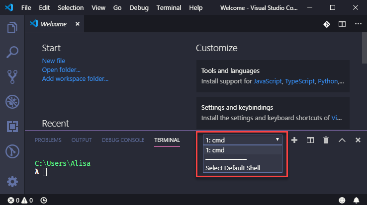
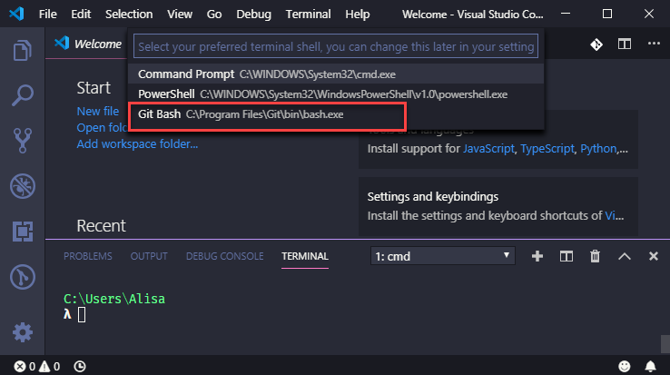

# Microsoft Visual Studio Code

Visual Studio Code is the **I**ntegrated **D**evelopment **E**nvironment \(**IDE**\) we use. It's software that helps you write the code. **IDE**s can do a lot of amazing things, such as:

* highlight the code so it's easier to identify expressions
* suggest completions to what you type
* help you navigate easily through the files in your project
* and a lot more...

After downloading we will configure it with extra tools called _extensions_ that will make your coding life easier.

## Install Visual Studio Code

Download [Visual Studio Code](https://code.visualstudio.com/) \(you'll often hear it referred as VS Code\) by clicking the green **Download for &lt;Windows OR Mac OR Linux&gt;** button. This will download the **Stable Build** for your operating system.

When download is complete, run the installer. Use default selection for all settings when asked. Visual Studio Code will automatically launch when the installation is complete.

You will see a welcome screen that looks something like this.

## Open Integrated Terminal

Visual Studio Code has a built in terminal. This makes it easy for us to use the command line while also writing code without having to switch between applications!

To open your terminal, select **Terminal** -&gt; **New Terminal**. The terminal view opens along the bottom of your application. You can also open multiple terminals. 

We will use multiple terminal tabs tomorrow during the workshop.

### Configure Terminal Settings (Windows Only)
We will use Git Bash as our terminal for the workshop. This allows us to provide instructions that apply to all the different **OS** \(**O**perating **S**ystem\) attendees use. 

In the terminal pane, press the down arrow in the terminal shell dropdown and select **Select Default Shell**. 

You can now select you preferred terminal shell. Select **Git Bash**. 

Press the **+** button next to the terminal shell dropdown to open a new terminal using Git Bash.
JAD TODO- Try this on the Surface to make sure this step is necessary.

## Install Required Extensions

We will install a required extension to add Angular language support, code completion (which helps fill in the blank as you type code), and  linting (notifications in code to help catch errors). Select the **Extensions** icon on the left toolbar.

1. When the installation noted in the previous section is complete, open VS Code and select the **Extensions** icon on the left toolbar.

    
Type "Angular Essentials" in the input. Find the "Angular Essentials" by John Papa and press the green **Install** button to install the extension.

2. Type "Angular Essentials" in the input. 
3. Press the **Install** button to install the extension.

    
## Optional- Install Color Themes

The "Angular Essentials" extension includes a color theme called "Winter is coming". You can choose a new theme by navigating to **File** -&gt; **Preferences** -&gt; **Color Theme** and select the theme you like out of the list.

The "Angular Essentials" extension includes a theme called "Winter is coming". 

You can choose a new theme by navigating to **File** -&gt; **Preferences** -&gt; **Color Theme** and select the theme you like out of the list.

If you want to try a different color theme, you can type in the theme you want in the **Extensions** search and click **Install**. 

Some popular themes include: 

* Night Owl
* Dracula
* Winter is Coming
* Summer Time
* Shades of Purple

