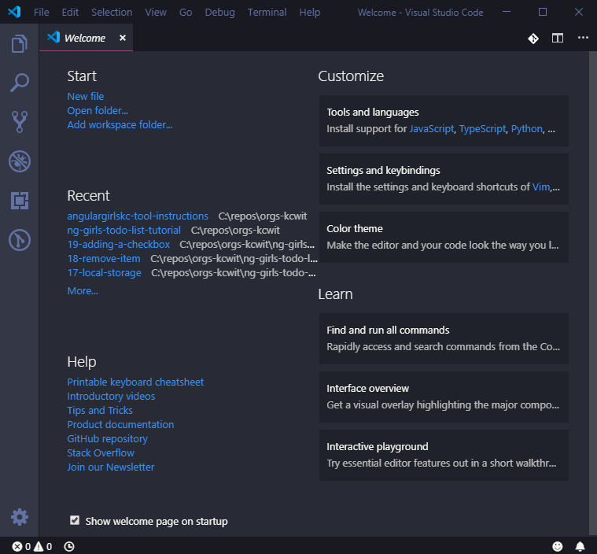

# macsOS & Linux

Navigate to [Visual Studio Code download site](https://code.visualstudio.com/download) and download the installer by clicking the download button for your OS.


**Linux Install instructions**

If you are using Linux, please follow the installation instructions from [VS Code documentation](https://code.visualstudio.com/docs/setup/linux). Then launch VS Code.


When download is complete, double-click on the download to expand the contents and drag `Visual Studio Code.app` to the `Application` folder. 

Launch Visual Studio Code. You will see a welcome screen that looks something like this.

## Add VS Code to PATH \(macOS only\)

We need to make VS Code findable by **Terminal**.

Open the **Command Palette** by selecting **View**  **Command Palette...**.

Type 'shell command' and select **Shell Command: Install 'code' command in PATH**

## Open Integrated Terminal

Visual Studio Code has a built in terminal. This makes it easy for us to use the command line while also writing code without having to switch between applications!

To open your terminal, select **Terminal**  **New Terminal**. The terminal view opens along the bottom of your application. You can also open multiple terminals.

We will use multiple terminal tabs tomorrow during the workshop.
