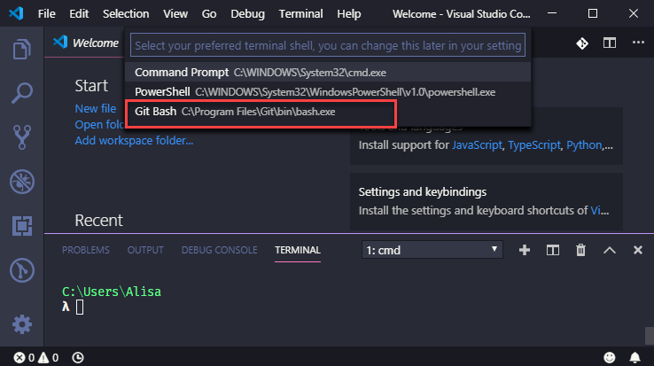
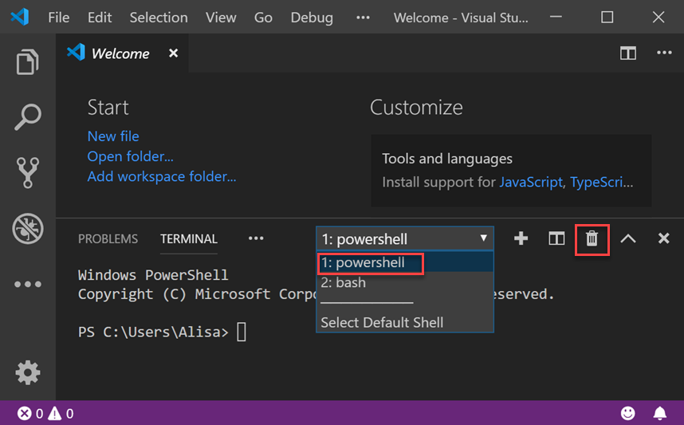

# Windows OS

Navigate to [Visual Studio Code download site](https://code.visualstudio.com/download) and click the download button for Windows. This will start downloading the VS Code installer.

When download is complete, run the installer using default selection for all settings when asked. 

When the installation is complete Visual Studio should launch automatically. You will see a welcome screen that looks something like this.

## Open Integrated Terminal

Visual Studio Code has a built in terminal. This makes it easy for us to use the command line while also writing code without having to switch between applications!

To open your terminal, select **Terminal**  **New Terminal**. The terminal view opens along the bottom of your application. You can also open multiple terminals.

We will use multiple terminal tabs during the workshop.

## Configure Terminal Settings

We will use Git Bash as our terminal for the workshop. This allows us to provide instructions that apply to all the different **OS** \(**O**perating **S**ystem\) attendees use.

In the terminal pane, press the down arrow in the terminal shell dropdown and select **Select Default Shell**.

You can now select you preferred terminal shell. Select **Git Bash**.

Press the **+** button next to the terminal shell dropdown to open a new terminal using Git Bash. You may close the first terminal by selecting **1: powershell** in the terminal shell dropdown and clicking the trashcan icon.

**Continue to Required Extensions**


