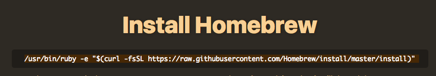

## Install Node and npm on Macs and Linux

### Homebrew

Homebrew is a package manager for macOS and Linux. It is an easy way to install and manage the tools we use. 

1. To determine if you need to follow the install or update instructions, [open your Terminal](https://www.wikihow.com/Open-a-Terminal-Window-in-Mac), type the following command, and press `Return/Enter`. 


You will always press `Return/Enter` after typing a command in the Terminal unless otherwise instructed.


```bash
brew doctor
```

2. If you see output stating "Your system is ready to brew." follow the instructions to [**Update Homebrew**](#update-homebrew).

#### Install Homebrew

1. In Google Chrome, navigate to the [Homebrew website](https://brew.sh/) to download and install Homebrew on your computer. 

2. On the website, copy the text underneath the "Install Homebrew" header as shown in the example picture below.



3. Paste the text you copied from the website into your Terminal window and press `Return/Enter`. Accept to install the "Command Line Developer Tools" and "License Agreement" if prompted.

4. At the prompt **Press RETURN to continue or any other key to abort**, press `Return/Enter`. When prompted, type in the password you use to log in to your computer.


It may look like you're not typing anything in but this is because it doesn't want to display your password on the screen for security. Type your full password and press `Return/Enter`.


5. The process will run for a few minutes until it completes. When finished type the following command in your Terminal and press `Return/Enter`.

```bash
brew -v
```

6. If you see a version number in the Terminal output Homebrew has installed successfully. 


#### Update Homebrew

If you already have Homebrew installed, update Homebrew by opening the command line Terminal, typing in the following command and then press `Return/Enter`.

```bash
brew update
```

### 

### Node

Homebrew will make installing and updating **Node** easier. 

To determine if you need to follow the install or update instructions, type the following command in your Terminal and press `Return/Enter`. 

```bash
node --version
```

If you see a version number in the output like the one shown in the picture below, follow the instructions to **Update Node**. 


Otherwise, continue to the next section for how to install Node. 

#### Install Node

In the Terminal, type the following command and press `Return/Enter` to install Node.

```bash
brew install node
```

#### Update Node

In the Terminal, type the following command and press `Reurn/Enter` to update Node.

```bash
brew upgrade node
```

### 

### npm

To install or update to the latest version of **npm**, in the Terminal, type the following command and press `Return/Enter`.

```bash
npm install npm@latest -g
```

Verify your installation by typing the following command.

```bash
npm --version
```
Close the command prompt window.
