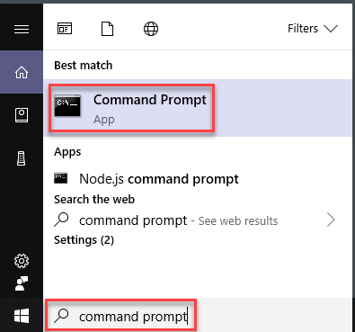
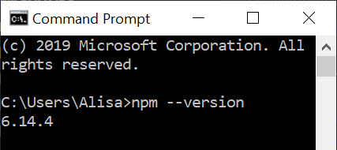

## Install Node And npm On Windows

### Install Node

1. Using the Google Chrome browser, navigate to the [Node Download for Windows page](https://nodejs.org/en) and select the latest version to download.

1. Node will begin to download on your computer. You will see the download's progress in the lower left-hand corner of your screen. 

1. Once the download is complete, click the file in the lower left-hand corner to open the installer. 

1. Click **Next** to work through the installer, selecting all default settings. When you reach the end of the steps, select **Install**. 

1. Once complete, verify your installation by opening the **Command Prompt** \(search for "cmd" in your computer's **Start** menu\).

    

1. In the **Command Prompt**, type the following command and press `Enter`. You will always press `Enter` after typing a command in the **Command Prompt** unless otherwise instructed.

   ```bash
   node --version
   ```

1. If the output contains a number as shown below, **Node** installed successfully.


### Install npm

1. To install or update to the latest version of **npm**, in the **Command Prompt**, type the following command and press `Enter`.

   ```bash
   npm install npm -g
   ```

1. Once the process completes, verify your installation by typing the following command and pressing `Enter`.

   ```bash
   npm --version
   ```

1. If the output shown in the command prompt contains a number as shown below, **npm** installed successfully.

   

1. Close the command prompt window.