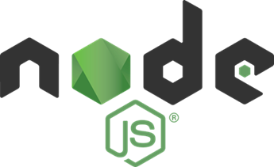

# Node

**Node** is a JavaScript runtime - this means JavaScript is no longer confined to a web browser. You can now run JavaScript on your computer.

**npm** \(**N**ode **P**ackage **M**anager\) is a package manager for JavaScript packages. npm allows you to manage and use code from other developers so you don't have to reinvent the wheel and can reuse handy bits of code for common functionality.

Click on the arrow (^) below to expand the section for your operating system.





