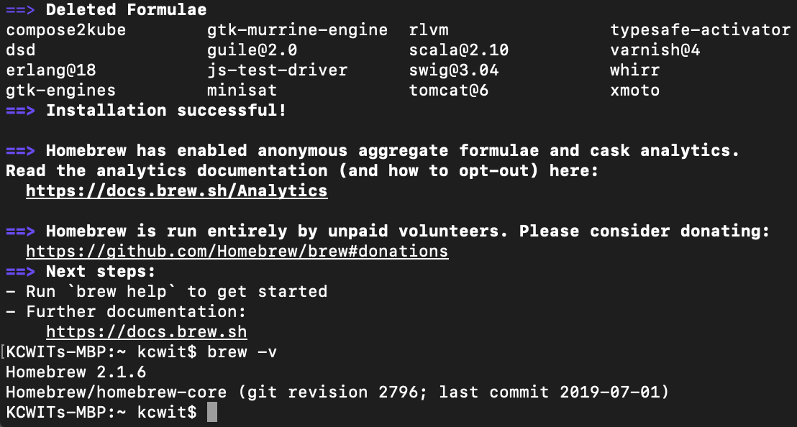

# Node

**Node** is a JavaScript runtime - this means JavaScript is no longer confined to a web browser. You can now run JavaScript on your computer.

**npm** \(**N**ode **P**ackage **M**anager\) is a package manager for JavaScript packages. This allows you to manage and use code from other developers so you don't have to reinvent the wheel and can reuse handy bits of code for common functionality.

## Install Node And npm On Windows

Download [Node](https://code.visualstudio.com/) by opening the link and clicking the green **Windows Installer** button. 

When download is complete, run the installer from your **Downloads** folder and use the default options provided.

Verify your installation by opening the **Command Prompt** \(search for "cmd" in your **Start** menu\). You may use another command terminal tool such as **Cmder** if you have it already installed.


 In the **Command Prompt**, type the following command and press `Enter`. You will always press `Enter` after typing a command in the **Command Prompt** unless otherwise instructed.

```bash
node --version
```

If the output contains a number as shown below, **Node** installed successfully.


To install or update to the latest version of **npm**, in the **Command Prompt**, type the following command.

```bash
npm install npm -g
```

Verify your installation by typing the following command.

```bash
npm --version
```

Close the **Command Prompt** by pressing the "X" at the top left of the window.

## Install Node And npm on Macs And Linux

### Homebrew

Homebrew is a package manager for macOS and Linux. It is an easy way to install and manage the tools we use. To determine if you need to follow the install or update instructions, open your terminal, type the following command, and press `Return/Enter`. You will always press `Return/Enter` after typing a command in the terminal unless otherwise instructed.

```bash
brew doctor
```

If you see output stating "Your system is ready to brew." follow the instructions to **Update Homebrew**.

#### Install Homebrew

Download and install Homebrew by opening the link and copy the text underneath the "Install Homebrew" header as shown in the picture below.


Open the terminal and paste the text you copied from the website and press `Return/Enter`. Accept to install the "Command Line Developer Tools" and "License Agreement" if prompted.

At the prompt **Press RETURN to continue or any other key to abort**, press `Return/Enter`. When prompted, type in the password you use to log in to your computer. 


It may look like you're not typing anything in but this is because it doesn't want to display your password on the screen for security. Type your full password and press `Return/Enter`.


The process will run for a few minutes until it completes. When finished type the following command in your terminal. 

```bash
brew -v
```

You should see a version number in the output for a successful installation.



#### Update Homebrew

If you already have Homebrew installed, update Homebrew by opening a terminal and typing in the following command.

```bash
brew update
```

### Node

Homebrew will make installing and updating **Node** easier. To determine if you need to follow the install or update instructions, type the following command in your terminal. If you see a version number in the output, follow the instructions to **Update Node**.


#### Install Node

In the terminal, type the following command to install Node.

```bash
brew install node
```

#### Update Node

In the terminal, type the following command to update Node.

```bash
brew update node
```

### npm

To install or update to the latest version of **npm**, in the terminal, type the following command.

```bash
npm install npm -g
```

Verify your installation by typing the following command.

```bash
npm --version
```

