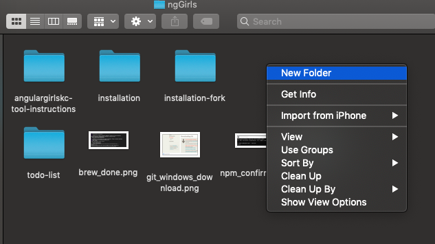
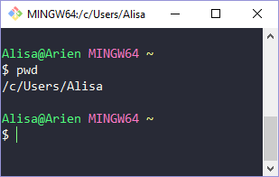

# ngGirls Folder


Next, we will create a project folder to use for the workshop.

You may be accustomed to creating folders in a file explorer on your computer to store documents like Word or Excel files.



We will do something very similar to that to create a folder to house our Angular project, only we will create it with the command line!

To begin, open the command line tool on your computer.

For Windows, open **Git Bash**.

For macOS & Linux, open **Terminal**.


A command line tool is also referred to as a "terminal".


## About the Command Line

When you open your command line tool, you'll see the prompt, in our case the `$` symbol.

The terminals we're using also prints out your current location in your computer's file system above the command prompt. When you first open your terminal, you should see `~` \(called a tilde\) that is a shortcut way to say you are at your **HOME** location.

You can also print out your current location in the file system by running `pwd` in the command line. This will **P**rint **W**orking **D**irectory without using the `~` shortcut to tell you where you are in the file system.



To make sure we can find our project folder for workshop, let's first make sure we're in our HOME directory. The command `cd` allows us to **C**hange **D**irectories. Run the following command to navigate HOME.



```bash
cd ~
```




Always press `Enter/Return` after typing each command in command line. This makes the command run in your computer.



**Command Line Woes?**

Check out our [handy command line reference](../tips/tips.md) list if you need a little help with command line operations.


## Create the Project Folder

In the command line, create a folder called 'nggirls-workshop' by running the following command:



```bash
mkdir nggirls-workshop
```




We use the terms "Folder" and "Directory" interchangeably. They mean the same thing.

`mkdir` stands for **Make Directory**. Then you provide the name of the directory that you want to create.

When you `mkdir` in the command line, you are doing the same thing as when you create a folder in a file explorer.


Let's verify we created our project folder by changing to the project directory by running the following command:



```bash
cd nggirls-workshop
```



