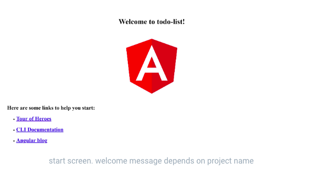

# Project Folder

Next, we will create a folder for the workshop to create our to-do list project in. 

You may be accustomed to creating folders in a file explorer on your computer to store documents like Word or Excel files. 


We will do something very similar to that to create a folder to house our to-do list project, only we will create it with the command line!

To begin, navigate to the command line on your computer. In the terminal, create a folder called nggirls-workshop by entering the following command:

```bash
mkdir nggirls-workshop
```

We use the terms "Folder" and "Directory" interchangeably. They mean the same thing.

**mkdir** stands for 'make directory'. Then you provide the name of the directory that you want to create.

When you **mkdir** in the command line, you are doing the same thing as when you create a folder in a file explorer.


Next, you'll want to enter the folder you just created. To do so, type the following command:

```bash
cd nggirls-workshop
```

**cd** stands for 'change directory'. 

When you type 'cd nggirls-workshop' into the command line, you are changing directory from where you were in the file structure into the nggirls-workshop directory that you just created.


Now that you are inside the nggirls-workshop folder, create a new project, called todo-list, using the Angular CLI, by running the following command:

```bash
ng new todo-list
```

(Depending on installation) Angular CLI will ask a couple of questions to help create a new application. Answer the questions as shown below: 

1. Would you like to add Angular routing? (y/N): N 
2. Which stylesheet format would you like to use? (Use arrow keys): CSS (Press Enter to select CSS)

This can take a while, since many packages are being downloaded from the web and installed.

Now enter the new folder that the Angular CLI created for this project by entering the following command into the terminal:


```bash
cd todo-list
```
Once inside the folder of the application, run the application by using the following command:

```bash
ng serve -o
```

The flag -o is a short for --open, which will open your browser in the right URL: localhost:4200​

You should see the page like this:



Yay! You know have a running Angular application! As long as you're working on the application you should keep the terminal where you run it open. Any change you make in the project code will be reflected immediately in the web browser.

You can open another terminal to perform tasks in parallel.
To stop the app from running, press Ctrl+C in the terminal, or close the terminal.

### **Congratulations!**

You've reach the end of the installation worksheet. You have installed all of the tools you will need to build your first Angular application! 

Give yourself a pat on the back and we'll see you back here tomorrow to continue working on your to-do list app. 


