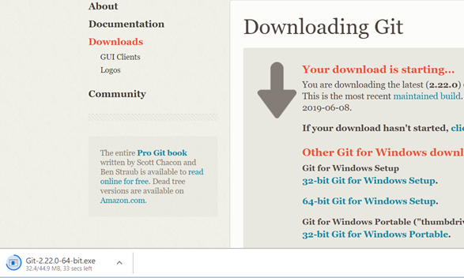

## Install Git on Windows

1. Go to the [Git Downloads](https://git-scm.com/downloads) page and select the Windows icon to begin downloading Git to your computer. 

    

1. Git will begin to download on your computer. You will see the download's progress in the lower left-hand corner of your screen. 

    

1. Once the download is complete, click the file in the lower left-hand corner to open the installer. 

1. Click **Next** to work through the installer using all default settings. When you reach the end of the steps, select **Install**.  

1. When the process completes, open **GitBash** and type `git --version` to ensure Git was properly installed. If it is properly installed you should see something like this in the terminal.

   ```bash
   git version 2.8.3
   ```

## Verify Install and Initialize User Settings 

Next, we need to configure our Git version control so that you can use it with your GitHub account.

Open **GitBash** and set your user name by running the following command and pressing `Enter`:

```bash
git config --global user.name "Your Name"
```


Replace the text "Your Name" with your own full name, keeping the quotation marks. i.e. "Jane Doe"


Next, set your user email address by running the following command and pressing `Enter`:

```bash
git config --global user.email youremail@example.com 
```


Replace youremail@example.com with your own email address.

