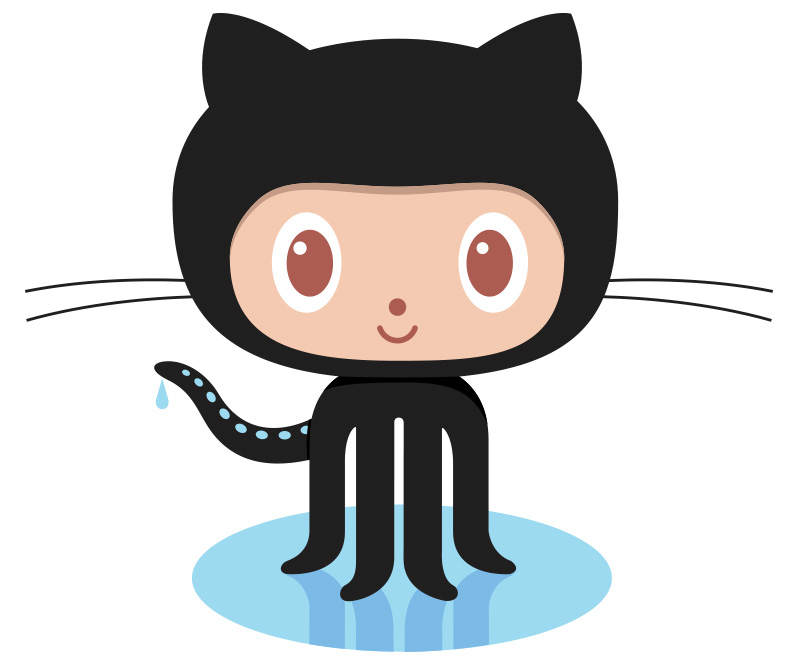

# GitHub

We will use GitHub, an essential cloud-based companion tool to Git. This is where your code repositories are stored.

GitHub allows you to publish your project on the web, copy (fork and clone) other open source projects and collaborate. We will use GitHub Pages to publish your project on the web by the end of this tutorial. To be able to publish your project, use the instructions below to create an account.


If you have attended a Coding & Cocktails session, you may already have a GitHub account. 

If you already have a GitHub account, you can skip to the next section.


## Create a GitHub Account

1. In your browser, [sign up for a GitHub account](https://github.com/join?source=header-home) by entering a username, email address, and password.

2. In Step 2: Choose your plan, select Unlimited public repositories for free and click Continue.

3. Fill out the survey or skip Step 3.

