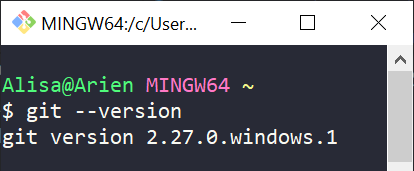

# Windows OS

## Install Git on Windows

Using Google Chrome, navigate to the [Git Downloads](https://git-scm.com/downloads) page and select the Windows icon to begin downloading Git to your computer.


Git will begin to download on your computer. You will see the download's progress in the lower left-hand corner of your screen.


Once the download is complete, click the file in the lower left-hand corner to open the installer. Click **Next** to work through the installer using all default settings. When you reach the end of the steps, select **Install**.

Once the installation is complete, we'll verify our installation using a command line tool called **Git Bash**.

Open **Git Bash** \(search for "git bash" in your computer's **Start** menu\).


Run the following command to ensure Git was properly installed.



```bash
git --version
```



If it is properly installed you should see something like this in the terminal. You must have Git version 2.16.0 or higher.



## Verify Install and Initialize User Settings

Next, we need to configure our Git version control so that you can use it with your GitHub account.

In **Git Bash** and set your user name by running the following command:



```bash
git config --global user.name "Your Name"
```




Replace the text "Your Name" with your own full name, keeping the quotation marks. i.e. "Jane Doe"


Next, set your user email address by running the following command:



```bash
git config --global user.email youremail@example.com
```




Replace youremail@example.com with your own email address.


Close **Git Bash** window.

**Continue to Microsoft Visual Studio Code**



