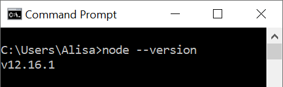

# Windows OS

## Install Node

Using the Google Chrome browser, navigate to the [Node Download for Windows page](https://nodejs.org/en) and select the latest version to download.

Node will begin to download on your computer. You will see the download's progress in the lower left-hand corner of your screen. Once the download is complete, click the file in the lower left-hand corner to open the installer. Click **Next** to work through the installer, selecting all default settings. When you reach the end of the steps, select **Install**.

Once the installation is complete, we'll verify our installation using a command line tool.


A command line tool is also referred to as a "terminal".


Open **Command Prompt** \(search for "command prompt" in your computer's **Start** menu\). We'll use the **Command Prompt** terminal as our command line until we install Git and have access to the terminal we'll use for the remainder of the workshop.


In **Command Prompt**, type the following command and press `Enter`.



```bash
node --version
```




You will always press `Enter` after typing a command in the command line unless otherwise instructed.


If the output contains a number as shown below, **Node** installed successfully. You must have Node version 10.9 or greater.



## Install npm

To install or update to the latest version of **npm**, run the following command.



```bash
npm install npm -g
```



Once the process completes, verify your installation by running the following command.



```bash
npm --version
```



If the output shown in the command prompt contains a number as shown below, **npm** installed successfully. You must have npm version 6.4.1 or greater.


Close the **Command Prompt** window.

**Continue to GitHub**



