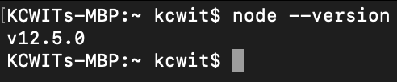

# macOS & Linux

## Homebrew

Homebrew is a package manager for macOS and Linux. It is an easy way to install and manage the tools we use.

We'll install the tools on this page using a command line tool.


A command line tool is also referred to as a "terminal".


To determine if you need to follow the install or update instructions, [open your **Terminal**](https://www.wikihow.com/Open-a-Terminal-Window-in-Mac), type the following command, and press `Return/Enter`.



```bash
brew doctor
```




You will always press `Return/Enter` after typing a command in the Terminal unless otherwise instructed.


If you see output stating "Your system is ready to brew." follow the instructions to [**Update Homebrew**](node-mac.md#update-homebrew).

### Install Homebrew

In Google Chrome, navigate to the [Homebrew website](https://brew.sh/) to download and install Homebrew on your computer. On the website, copy the text underneath the "Install Homebrew" header as shown in the example picture below.


Paste the text you copied from the website into your Terminal window and press `Return/Enter` to run the command. Accept to install the "Command Line Developer Tools" and "License Agreement" if prompted.

At the prompt **Press RETURN to continue or any other key to abort**, press `Return/Enter`. When prompted, type in the password you use to log in to your computer.


It may look like you're not typing anything in but this is because it doesn't want to display your password on the screen for security. Type your full password and press `Return/Enter`.


The process will run for a few minutes until it completes. When finished run the following command.



```bash
brew -v
```



If you see a version number in the Terminal output Homebrew has installed successfully.


### Update Homebrew

If you already have Homebrew installed, update Homebrew by opening the **Terminal** and run the following command.



```bash
brew update
```



## Node

Homebrew will make installing and updating **Node** easier.

To determine if you need to follow the install or update instructions, run following command.



```bash
node --version
```



If you see a version number in the output like the one shown in the picture below, follow the instructions to [Update Node](node-mac.md#update-node). You must have Node version 10.9 or greater.



Otherwise, continue to the next section for how to install Node.

### Install Node

Run the following command to install Node.



```bash
brew install node
```



### Update Node

Run the following command to update Node.



```bash
brew upgrade node
```



## npm

To install or update to the latest version of **npm**, run the following command.



```bash
npm install npm@latest -g
```



Verify your installation by running the following command. You must have npm version 6.4.1 or greater.



```bash
npm --version
```




Close the Terminal window.

